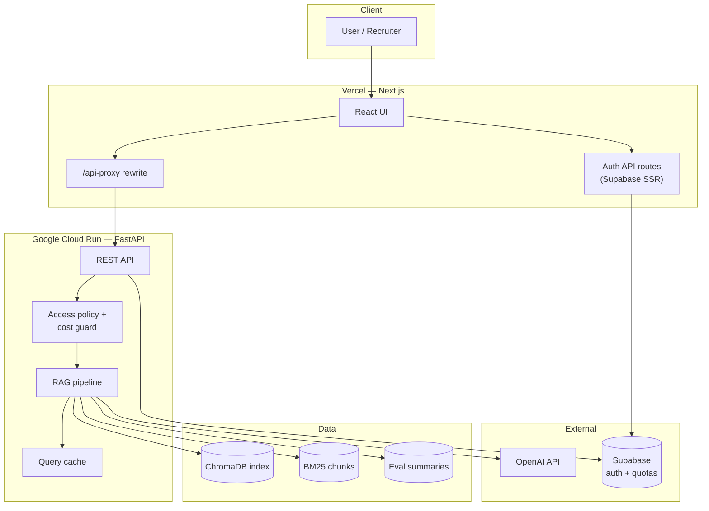

# SEC Insight AI

**Citation-grounded Q&A over SEC 10-K filings — hybrid retrieval, measured on a 50-question gold set, deployed as a split Next.js + FastAPI stack.**

Ask natural-language questions against five indexed 10-K filings (Apple, Walmart, ExxonMobil, Eli Lilly, JPMorgan Chase). Every live answer is tied to retrieved passages with inline citations, pre-generation answerability checks, and server-side cost guards.

[](https://www.python.org/)
[](https://fastapi.tiangolo.com/)
[](https://nextjs.org/)
[](https://rag-sec-10k-alpha.vercel.app)
[](https://www.trychroma.com/)
[](https://platform.openai.com/)

---

## Live demo

| | Link |
|---|------|
| **Web app** | **[https://rag-sec-10k-alpha.vercel.app](https://rag-sec-10k-alpha.vercel.app)** |
| **API health** | [https://sec-insight-api-223362217905.us-central1.run.app/health](https://sec-insight-api-223362217905.us-central1.run.app/health) |
| **GitHub** | [Bijay-Thakur/rag-sec-10k](https://github.com/Bijay-Thakur/rag-sec-10k) |

> The frontend is deployed on **Vercel** (`frontend/` root directory). The backend runs as a **Dockerized FastAPI** service on **Google Cloud Run** (`us-central1`).

## Demo video

**[Watch the walkthrough →](https://www.loom.com/share/cee7b50bc1e648c3b1aaa32b71da48de)** _(replace with your latest Loom / YouTube link)_

---

## Architecture



**Request path:** Browser → Next.js (same-origin `/api-proxy`) → FastAPI → hybrid retrieval → answerability gate → optional LLM generation → cited response with retrieval trace.

---

## Features

| Capability | Description |
|------------|-------------|
| **Structured SEC filing parsing** | Native EDGAR HTML ingestion with Part/Item detection and inline XBRL unwrap |
| **Hybrid BM25 / vector retrieval** | Dense embeddings (ChromaDB) + lexical BM25 over the same chunk index |
| **RRF fusion** | Reciprocal rank fusion combines semantic and BM25 rankings |
| **Cross-encoder reranking** | `ms-marco-MiniLM-L-6-v2` reranker benchmarked on the gold set (+8 pp Recall@1 vs semantic alone) |
| **Citation-grounded generation** | GPT-4o-mini with enforced `[n]` references back to source passages |
| **Answerability detection** | Pre-generation gate: answerable, partial, not answerable, or calculation-required |
| **Deterministic financial calculations** | Python calculation engine for YoY %, ratios, and CAGR — no LLM arithmetic |
| **Evaluation dashboard** | In-app view of retrieval and RAGAS metrics from committed eval artifacts |
| **Caching** | In-memory query cache; embed-once index build; demo mode skips LLM entirely |
| **API cost guard** | Deployment-wide daily LLM/cost caps, per-user Supabase quotas, token limits, rate limiting |
| **Deployed frontend / backend** | Next.js on Vercel + FastAPI Docker image on Cloud Run, Supabase auth |

Indexed filings: `apple_2025`, `walmart_2026`, `exxon_2025`, `elilily_2025`, `chase_2025`.

---

## Evaluation results

Measured on a **50-question hand-curated gold set** (Apple 2025 10-K primary corpus; chunk-level relevance labels). Metrics from [`data/eval/retrieval_summary.json`](data/eval/retrieval_summary.json) and [`data/eval/ragas_summary.json`](data/eval/ragas_summary.json).

### Retrieval (best strategy: hybrid + cross-encoder rerank)

| Metric | hybrid + rerank | hybrid (RRF) | semantic |
|--------|-----------------|--------------|----------|
| **Recall@1** | **0.74** | 0.64 | 0.66 |
| **Recall@5** | **0.88** | 0.86 | 0.86 |
| **MRR** | **0.803** | 0.732 | 0.741 |
| Mean latency | 1,056 ms/q | 17 ms/q | 4 ms/q |

Production UI uses **hybrid RRF** (no reranker in the hot path — reranker adds ~1 s latency; eval proves the quality uplift).

### Generation (20-question RAGAS sample, hybrid retrieval)

| Metric | Score |
|--------|-------|
| **RAGAS faithfulness** | **0.99** |
| Answer relevancy | 0.83 |
| Context recall | 0.84 |
| Context precision | 0.86 |

Reproduce locally: `python scripts/print_all_metrics.py`

---

## Cost control

Designed for a **public demo** without runaway OpenAI spend.

| Control | Mechanism |
|---------|-----------|
| **Cached demo mode** | Anonymous users forced to `demo_mode=true` — live BM25 retrieval, **zero LLM calls** |
| **Max token limits** | `MAX_INPUT_TOKENS` / `MAX_OUTPUT_TOKENS` cap context and completion size |
| **Daily call limit** | `MAX_DAILY_LLM_CALLS` — deployment-wide cap (resets on container cold start) |
| **Daily cost limit** | `MAX_DAILY_ESTIMATED_COST_USD` — estimated spend guard before live generation |
| **Recruiter password mode** | Sign in with **email + password** for gated live LLM (3 free calls/account via Supabase quota). Anonymous traffic stays retrieval-only. Set `ENABLE_LIVE_LLM_CALLS=false` on Cloud Run to disable live LLM entirely. |

Additional layers: tiered rate limits (30–300 req/hr), per-user quota in Postgres, query response cache, server-side access policy (client cannot bypass demo mode).

Template: [`cloudrun.env.example`](cloudrun.env.example)

---

## Failure modes

The system is explicit about what it **will not** do:

| Scenario | Behavior |
|----------|----------|
| **Unsupported questions** | Topics outside the five indexed filings or unrelated to 10-K content → low retrieval score → **not answerable** refusal |
| **Future predictions** | Heuristic detection of forecast / “will X grow” phrasing → blocked or flagged before generation |
| **Missing evidence** | Insufficient relevant chunks → fixed refusal: _“I could not find enough evidence in the retrieved 10-K sections…”_ |
| **Arithmetic uncertainty** | Calculation-style questions route to the **deterministic engine**; if figures cannot be extracted confidently, partial answer or refusal — the LLM does not invent numbers |

Partially answerable questions receive citations for supported facts plus a _“Missing from the filing:”_ note for unsupported parts.

---

## Local setup

### Prerequisites

- Python 3.12+, Node 20+
- OpenAI API key (optional for demo mode; required for live LLM)
- Chroma index built once: `python src/Embed/embed.py`

### Run (Next.js + FastAPI)

```powershell
# Terminal 1 — backend (repo root)
.\scripts\start-backend.ps1
# or: uvicorn backend.app.main:app --reload --host 127.0.0.1 --port 8770

# Terminal 2 — frontend
.\scripts\start-frontend.ps1
# or: cd frontend && npm run dev
```

Open `http://localhost:3000`. Copy env templates:

```bash
cp .env.example .env
cp frontend/.env.example frontend/.env.local
```

### Docker Compose (production-like)

```bash
cp .env.example .env
docker compose up --build
```

| Service | URL |
|---------|-----|
| Frontend | http://localhost:3000 |
| Backend | http://localhost:8080 |
| Health | http://localhost:8080/health |

### Tests / CI

```bash
pip install -r backend/requirements.txt pytest httpx
python scripts/ci_bootstrap_db.py
pytest tests/ -q

cd frontend && npm ci && npm run build
```

---

## Deployment

Split deployment: **Vercel (frontend)** + **Cloud Run (backend)** + **Supabase (auth/quotas)**.

| Component | Platform | Production URL / setting |
|-----------|----------|--------------------------|
| Frontend | Vercel — root dir **`frontend`** | [rag-sec-10k-alpha.vercel.app](https://rag-sec-10k-alpha.vercel.app) |
| Backend | Google Cloud Run — Docker | `https://sec-insight-api-223362217905.us-central1.run.app` |
| Auth / quotas | Supabase Postgres | [`supabase/migrations/001_user_profiles.sql`](supabase/migrations/001_user_profiles.sql) |
| Image build | Google Cloud Build | [`cloudbuild.yaml`](cloudbuild.yaml) → Artifact Registry |

Detailed runbook: [`docs/DEPLOYMENT.md`](docs/DEPLOYMENT.md)

### Production configuration checklist

After deploying both services, confirm these values are set (otherwise the UI may show **“API offline”** or auth may fail):

| Where | Variable | Production value |
|-------|----------|------------------|
| **Vercel** | `NEXT_PUBLIC_API_BASE_URL` | `https://sec-insight-api-223362217905.us-central1.run.app` |
| **Vercel** | `NEXT_PUBLIC_SITE_URL` | `https://rag-sec-10k-alpha.vercel.app` |
| **Vercel** | `NEXT_PUBLIC_SUPABASE_URL` | Your Supabase project URL |
| **Vercel** | `NEXT_PUBLIC_SUPABASE_ANON_KEY` | Supabase anon key |
| **Vercel** | `SUPABASE_URL` | Same Supabase URL |
| **Vercel** | `SUPABASE_SERVICE_ROLE_KEY` | Supabase service role key (server-only) |
| **Cloud Run** (`cloudrun.env`) | `FRONTEND_ORIGIN` | `https://rag-sec-10k-alpha.vercel.app` |
| **Cloud Run** | `OPENAI_API_KEY`, Supabase secrets | See [`cloudrun.env.example`](cloudrun.env.example) |
| **Supabase Auth** | Redirect URL | `https://rag-sec-10k-alpha.vercel.app/api/auth/confirm` |
| **Supabase Auth** | Site URL | `https://rag-sec-10k-alpha.vercel.app` |

Redeploy Vercel after any `NEXT_PUBLIC_*` change. Update Cloud Run env vars separately via `gcloud run services update`.

### Vercel (frontend)

This repo is a **monorepo** — deploy **only** the Next.js app, not the FastAPI backend (backend lives on Cloud Run).

1. Import [Bijay-Thakur/rag-sec-10k](https://github.com/Bijay-Thakur/rag-sec-10k) → branch **`main`**.
2. Set **Root Directory** to **`frontend`** (do not use the multi-service “Services” preset for backend).
3. **Framework Preset:** Next.js.
4. **Output Directory:** leave **empty** (do not set `public` or `.next` — that causes 404 or build failure).
5. Add environment variables from the checklist above.
6. Deploy; redeploy after any `NEXT_PUBLIC_*` change.

**Do not put on Vercel:** `OPENAI_API_KEY`, `SUPABASE_JWT_SECRET`, `FRONTEND_ORIGIN`, or other backend-only secrets.

Template: [`frontend/.env.example`](frontend/.env.example)

### Cloud Run (backend)

Images are built in GCP (recommended — avoids local Docker OOM during PyTorch install):

```bash
# One-time: enable APIs, Artifact Registry, Cloud Build (see docs/DEPLOYMENT.md)

gcloud builds submit . --config=cloudbuild.yaml
```

`cloudbuild.yaml` bootstraps the Chroma index on the build VM (`scripts/ci_bootstrap_db.py`) because `db/` is gitignored and not uploaded (see [`.gcloudignore`](.gcloudignore)).

Deploy the image:

```bash
cp cloudrun.env.example cloudrun.env   # edit locally — never commit

gcloud run deploy sec-insight-api \
  --image us-central1-docker.pkg.dev/sec-insight-ai/cloud-run-source-deploy/sec-insight-api:latest \
  --region us-central1 \
  --port 8080 \
  --memory 2Gi \
  --cpu 2 \
  --timeout 300 \
  --allow-unauthenticated \
  --env-vars-file cloudrun.env
```

**Important:** Do **not** set `PORT` in `cloudrun.env` — Cloud Run injects it automatically (setting it causes deploy failure).

Wire CORS after Vercel is live:

```bash
gcloud run services update sec-insight-api \
  --region us-central1 \
  --update-env-vars FRONTEND_ORIGIN=https://rag-sec-10k-alpha.vercel.app
```

Full commands (Artifact Registry, Secret Manager, health check): [`docs/DEPLOYMENT.md`](docs/DEPLOYMENT.md)

**Cost safety:** Configure GCP billing alerts. OpenAI usage is billed separately — use `ENABLE_LIVE_LLM_CALLS`, daily caps, and OpenAI spending limits.

---

## API endpoints

Base URL: `http://127.0.0.1:8770` (local) or `https://sec-insight-api-223362217905.us-central1.run.app` (production). Browser traffic from the UI goes through Next.js `/api-proxy`.

| Method | Path | Auth | Description |
|--------|------|------|-------------|
| `GET` | `/health` | — | Service health, index status, available filings |
| `GET` | `/api/filings` | — | Filing catalog |
| `GET` | `/api/sample-questions` | — | Curated questions per filing |
| `POST` | `/api/ask` | Optional JWT | RAG query; server enforces demo vs live LLM |
| `GET` | `/api/me/entitlements` | Optional JWT | Remaining LLM quota and plan |
| `GET` | `/api/eval/summary` | — | Retrieval + RAGAS metrics for dashboard |

**Example — demo ask (no auth, no LLM cost):**

```bash
curl -X POST http://127.0.0.1:8770/api/ask \
  -H "Content-Type: application/json" \
  -d '{"question": "What were Apple total net sales in fiscal 2025?", "filing_id": "apple_2025", "demo_mode": true}'
```

**Example — health check (production):**

```bash
curl https://sec-insight-api-223362217905.us-central1.run.app/health
```

Interactive docs (`/docs`) are disabled in production unless `DEBUG=true`.

---

## Tech stack

| Layer | Technology |
|-------|------------|
| Ingestion | BeautifulSoup + lxml (XBRL-aware HTML) |
| Embeddings | OpenAI `text-embedding-3-small` → ChromaDB |
| Lexical | BM25Okapi |
| Fusion / rerank | Manual RRF + cross-encoder (eval) |
| Generation | GPT-4o-mini, citation prompt |
| Backend | FastAPI, slowapi rate limits, Supabase REST |
| Frontend | Next.js 15, Tailwind, Supabase SSR auth |
| Deploy | Vercel + Cloud Run (Docker) + Cloud Build |
| Eval | RAGAS, custom R@k / MRR scripts |

---

## Contact

Built by **Bijay Thakur** — Applied AI / AI engineering portfolio project.

- GitHub: [@Bijay-Thakur](https://github.com/Bijay-Thakur)
- Repo: [rag-sec-10k](https://github.com/Bijay-Thakur/rag-sec-10k)
